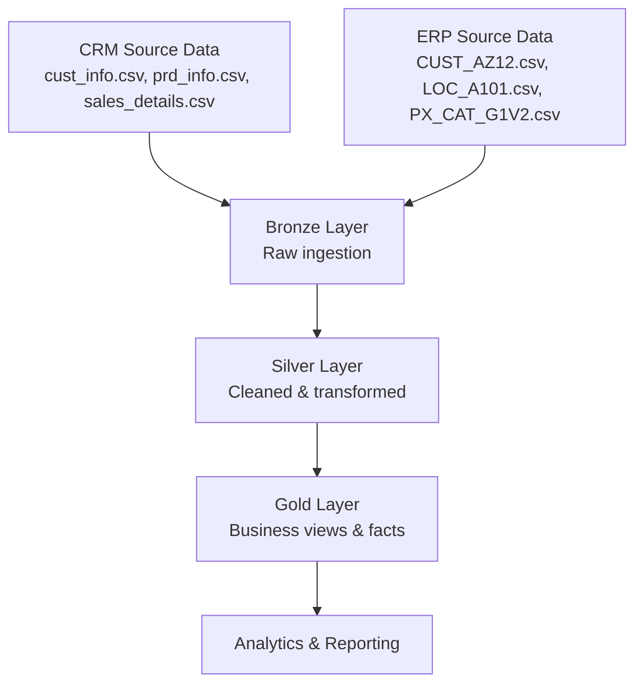

# SQL Data Warehouse Project

A comprehensive data warehouse implementation using SQL Server, featuring ETL processes and data modeling with a medallion architecture (Bronze, Silver, Gold layers). This project demonstrates building a scalable data warehouse from raw source data to business-ready analytics.

## Table of Contents
- [Overview](#overview)
- [Architecture](#architecture)
- [Features](#features)
- [Prerequisites](#prerequisites)
- [Installation](#installation)
- [Usage](#usage)
- [Project Structure](#project-structure)
- [Technologies](#technologies)
- [Contributing](#contributing)
- [License](#license)

## Overview
This project builds a data warehouse to integrate and analyze customer and sales data from CRM and ERP systems. It follows modern data engineering practices with a layered architecture for data quality and performance. The ETL pipeline transforms raw data into structured dimensions and facts for reporting and analytics.

Key objectives:
- Ingest raw data from multiple sources (CSV files)
- Clean and standardize data across systems
- Create unified customer and product views
- Enable sales analytics with fact tables

## Architecture
The project uses a **Medallion Architecture** with three layers:



- **Bronze Layer:** Raw data storage, mirroring source schemas
- **Silver Layer:** Standardized, cleaned data with business rules applied
- **Gold Layer:** Aggregated dimensions and facts for end-user consumption

*Note: DBT (Data Build Tool) is planned for future ETL orchestration but not yet implemented.*

## Features
- Multi-source data integration (CRM + ERP)
- Automated ETL pipeline with Python and SQL
- Data quality improvements (standardization, deduplication)
- Audit trails with creation timestamps
- Modular SQL scripts for easy maintenance
- Exploratory data analysis (EDA) queries included

## Prerequisites
- **SQL Server** (Express or Developer Edition) with SQL Server Management Studio (SSMS)
- **Python 3.8+** with virtual environment support
- **ODBC Driver 17 for SQL Server** (install from Microsoft)
- **Git** for cloning the repository
- Basic knowledge of SQL and Python

## Installation
1. **Clone the repository:**
   ```bash
   git clone https://github.com/yourusername/SQL-DataWarehouse-Project.git
   cd SQL-DataWarehouse-Project
   ```

2. **Set up Python virtual environment:**
   ```bash
   python -m venv SQL_DW
   # On Windows:
   SQL_DW\Scripts\activate
   # On macOS/Linux:
   source SQL_DW/bin/activate
   ```

3. **Install dependencies:**
   ```bash
   pip install -r requirements.txt
   ```

4. **Set up SQL Server database:**
   - Ensure SQL Server is running (default instance: `localhost\SQLEXPRESS`)
   - Open SSMS and connect to your server
   - Run the database setup script: `Scripts\01.Bronze_Layer\1.1.DataWarehouse_setup.sql`
   - This creates the `DataWarehouse` database with Bronze, Silver, and Gold schemas

5. **Configure connection (if needed):**
   - Update server details in `Scripts\01.Bronze_Layer\1.3.DataIngestion.py` if not using default SQL Express

## Usage
Follow these steps to build and populate the data warehouse:

### 1. Bronze Layer Setup
```sql
-- Run in SSMS or sqlcmd
sqlcmd -S localhost\SQLEXPRESS -i Scripts\01.Bronze_Layer\1.2.TableCreation_ddl.sql
```

### 2. Data Ingestion
```bash
python Scripts/01.Bronze_Layer/1.3.DataIngestion.py
```
This loads CSV data from `Datasets/` into Bronze tables.

### 3. Silver Layer ETL
```sql
-- Create Silver tables
sqlcmd -S localhost\SQLEXPRESS -i Scripts\02.Silver_Layer\2.1.TableCreation_ddl.sql

-- Run ETL transformations (run each script in order)
sqlcmd -S localhost\SQLEXPRESS -i Scripts\02.Silver_Layer\2.2.ETL_Silver_CRM_CustomerInfo.sql
sqlcmd -S localhost\SQLEXPRESS -i Scripts\02.Silver_Layer\2.3.ETL_Silver_CRM_ProductInfo.sql
-- ... continue with other ETL scripts
```

### 4. Gold Layer Views
```sql
-- Create dimension and fact views
sqlcmd -S localhost\SQLEXPRESS -i Scripts\03.Gold_Layer\dim_customers.sql
sqlcmd -S localhost\SQLEXPRESS -i Scripts\03.Gold_Layer\dim_products.sql
sqlcmd -S localhost\SQLEXPRESS -i Scripts\03.Gold_Layer\fact_sales.sql
```

### 5. Verification
Run EDA scripts to explore data:
```sql
sqlcmd -S localhost\SQLEXPRESS -i Scripts\01.Bronze_Layer\1.5.EDA_Bronze_CustomerInfo.sql
```

## Project Structure
```
SQL-DataWarehouse-Project/
├── README.md                 # Project documentation
├── requirements.txt          # Python dependencies
├── LICENSE                   # License file
├── Datasets/                 # Source data files
│   ├── CRM source_data/      # CRM CSV files
│   └── ERP source_data/      # ERP CSV files
├── Scripts/                  # SQL and Python scripts
│   ├── 01.Bronze_Layer/      # Raw data layer
│   │   ├── 1.1.DataWarehouse_setup.sql
│   │   ├── 1.2.TableCreation_ddl.sql
│   │   ├── 1.3.DataIngestion.py
│   │   └── 1.5-1.7 EDA scripts
│   ├── 02.Silver_Layer/      # Cleaned data layer
│   │   ├── 2.1.TableCreation_ddl.sql
│   │   └── 2.2-2.6 ETL scripts
│   └── 03.Gold_Layer/        # Business layer
│       ├── dim_customers.sql
│       ├── dim_products.sql
│       └── fact_sales.sql
└── SQL_DW/                   # Python virtual environment
```

## Technologies
- **Database:** SQL Server
- **ETL:** Python (Pandas, SQLAlchemy)
- **Connectivity:** PyODBC
- **Version Control:** Git
- **Documentation:** Markdown
- **Diagrams:** Mermaid

## Contributing
1. Fork the repository
2. Create a feature branch (`git checkout -b feature/amazing-feature`)
3. Commit your changes (`git commit -m 'Add amazing feature'`)
4. Push to the branch (`git push origin feature/amazing-feature`)
5. Open a Pull Request

Please ensure code follows SQL best practices and includes comments for complex logic.

## License
This project is licensed under the MIT License - see the [LICENSE](LICENSE) file for details.

---

*For questions or issues, please open a GitHub issue or contact the maintainers.*
